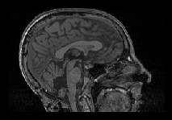
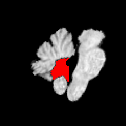

# Cerebellar Damage Detection Tool

A software to detect cerebellar damage after tumor resection. Created by the Vision Lab at the Department of Dianostic Imaging, St. Jude Children's Resesarch Hospital.


## About

This software automatically detects and segments missing cerebellum using postoperative 3D T1 whole brain MRI. It first classifies brain tissue into 3 classes (white matter, gray matter, and other), and then normalizes the cerebellum white & gray matter into an atlas space. The missing tissue is detected in the atlas space.

An example result:




## Installation

1. Install Docker from Docker's website here: https://www.docker.com/get-started. Follow instructions on that link to get Docker set up properly on your workstation.

2. Pull Docker container from https://hub.docker.com/repository/docker/zhangsilu17/cb_norm_damage. Use the command 
```bash
docker pull zhangsilu17/cb_norm_damage:0.0.5
```


## How to use
1. Inputs

Put 3D T1 MRI images in nifti forrmat (*.nii.gz) in a input directory <input_directory> organized by patient (each patient uses a subdirectory under <input_directory>). Example inputs are provided in this repository under `input`. 3D T1 image should be name as *t1.nii.gz and this is the only required input. Optionally, users can provide additional MRI inputs (e.g. FLAIR, T2) in <input_directory>/<patient_ID> with names other than *t1.nii.gz. Only the file named as *t1.nii.gz will be recognized as 3D T1 and used for brain tissue segmentation and damage detection. Other inputs will be coregisted to 3D T1 and normalized to the atlas space for manual editing if the damge is better seen on other MRI contrasts. 

2. Create an empty output directory <output_directory>

3. Command to run:
```bash
docker run --rm -ti -v <input_directory>:/cb_norm_damage/input -v <output_directory>:/cb_norm_damage/output zhangsilu17/cb_norm_damage:0.0.5
```
4. Outputs

Outputs of each patient are saved under <output_directory>/<patient_ID>. The software detects the largest 3 connected components of the missing volumue and save them as *damage_0.nii.gz, *damage_1.nii.gz, *damage_2.nii.gz. By default, it uses the largest component (*damamge_0.nii.gz) as the damage VOI and save it as *damage.nii.gz. 


## Citation

If you use this software in your published work, please cite:
Zhang, S., McAfee, S., Patay, Z. and Scoggins, M., 2022. Automatic Detection and Segmentation of Postoperative Cerebellar Damage Based on Normalization. arXiv preprint arXiv:2203.02042. https://arxiv.org/abs/2203.02042


## Contact

This software is under active development, and you may run into errors or want additional features. Send any questions or requests to silu.zhang@stjude.org. You can also submit a Github issue if you run into a bug.


## Disclaimer

This software is intended for research purposes only and has not yet been validated for clinical use.